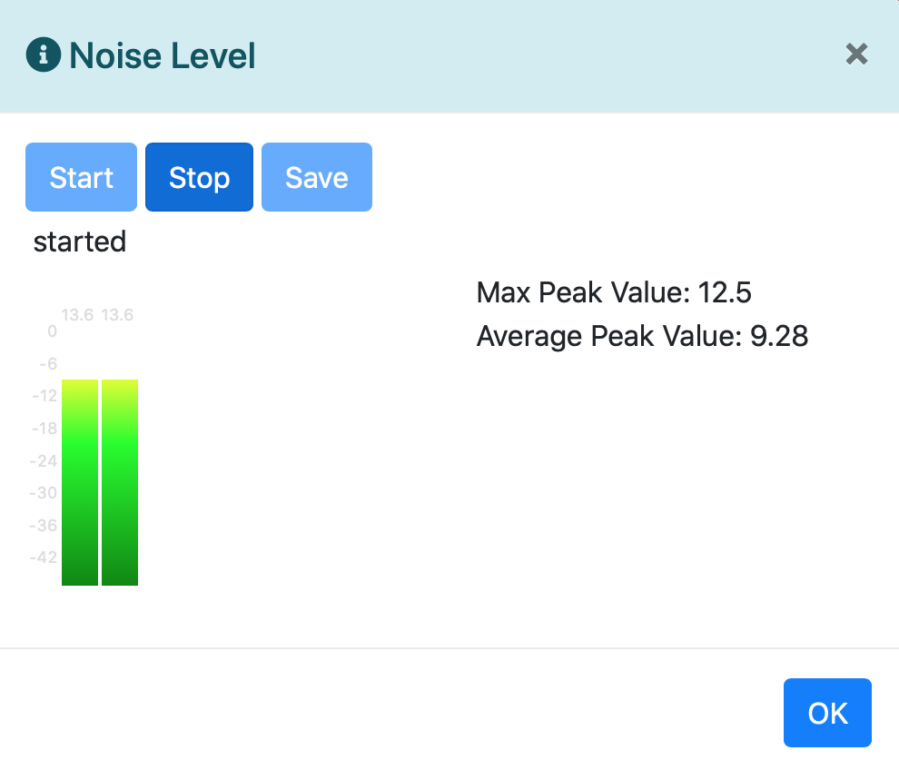
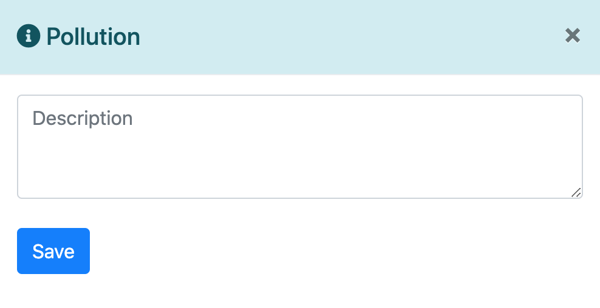
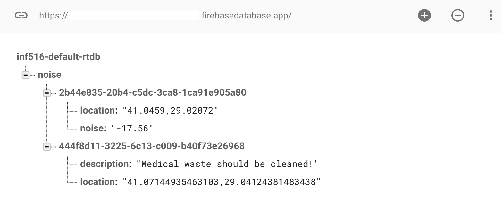

# Mobile Crowd Sensing and Computing
Environmental Pollution Reporting Tool

**My aim is to develop a website for detection of environmental problems such as noise pollution and environmental pollution through participatory sensing. With the *Mobile Crowd Sensing and Computing* model, crowd is enabled to send detected sensor data from mobile devices to the cloud, then monitor it on the website.**

MCSC Map:

Noise Level Measuring:

Environmental Pollution Reporting:

Database Design:

If you want to run this project, you must add your Firebase Project keys to **/js/init.js**

